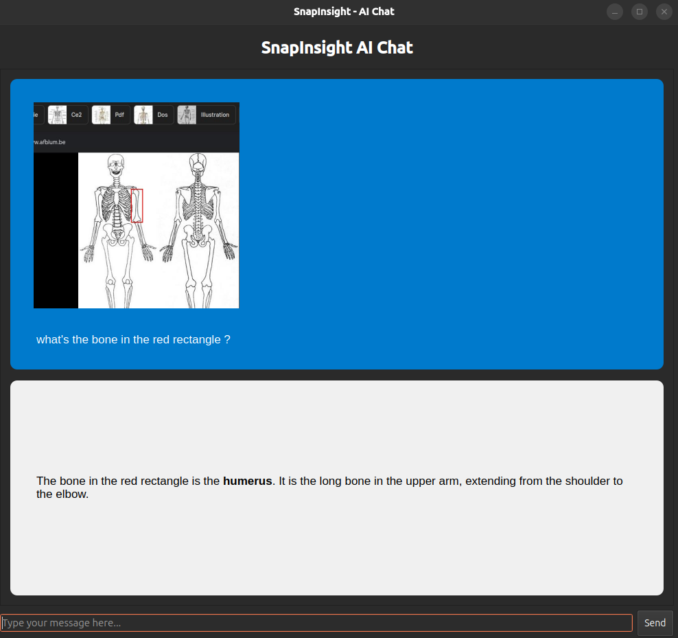
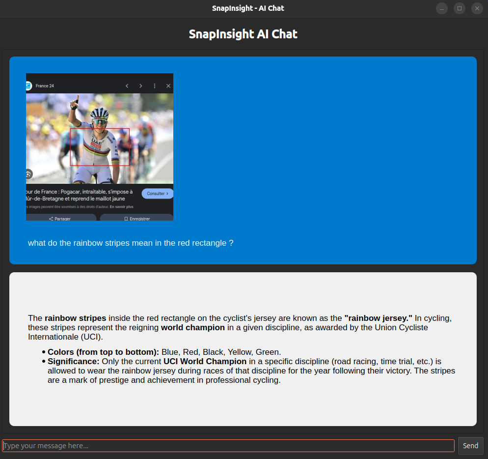
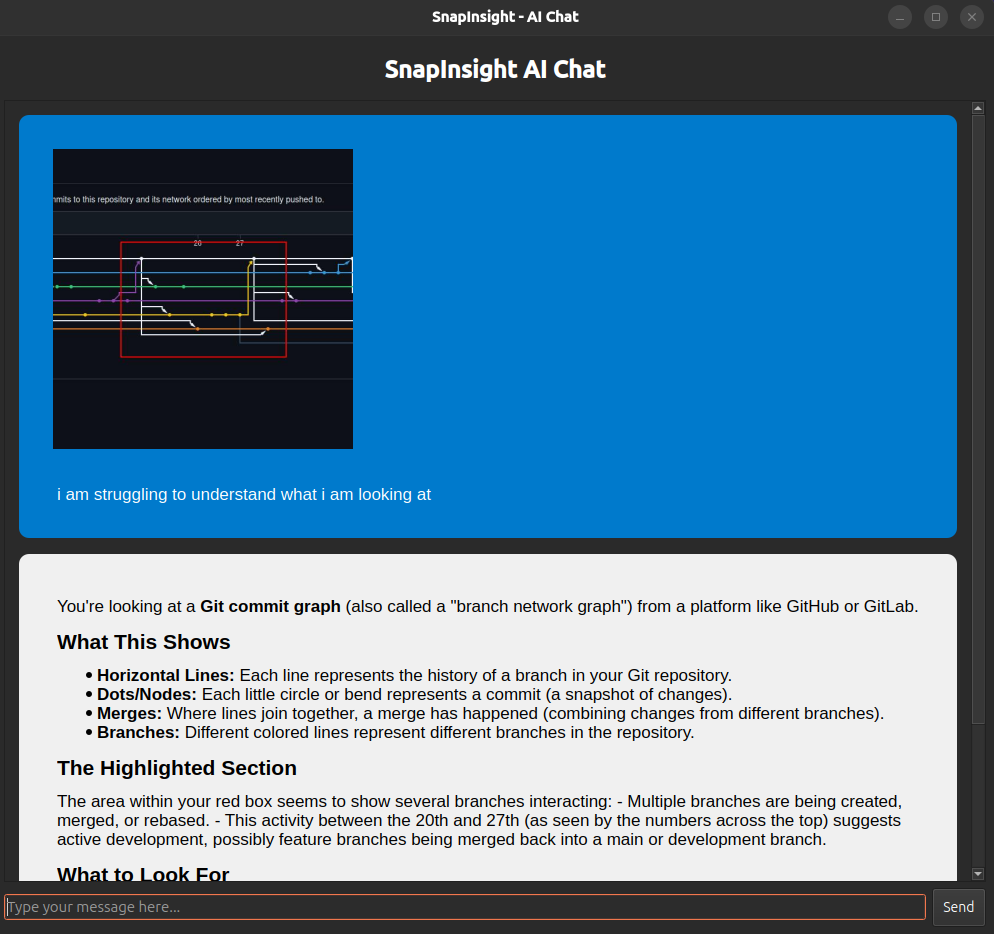

# SnapInsight

### Overview:

Don't understand something on your screen ? SnapInsight takes a screenshot and lets you highlight with a red rectangle what you don't understand. You can then talk about it with gpt-4.1. It can be linked to a shortcut for faster use.

### Usage:

- Create a python virtual environment
- Install the riqurements
- Set the ``OPENAI_API_KEY`` environment variable
- Execute main.py

### Exemples of use cases:

Example of SnapInsight in action: asking about anatomy.

Example of SnapInsight in action: learning about cycling championships.

Example of SnapInsight in action: understanding git commit graphs.

